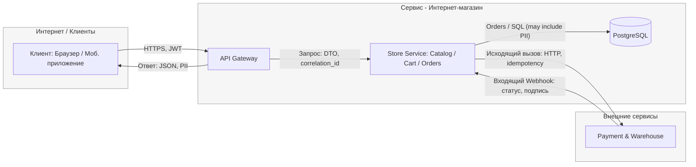

# TM - Требования безопасности + Модель угроз + ADR

## 0) Мета

- **Проект (опционально BYO):** Учебный шаблон (интернет-магазин)
- **Версия (commit/date):** 2025-11-09
- **Кратко (1-2 предложения):** Система представляет собой платформу для e-commerce, которой пользуются клиенты для совершения покупок и администраторы для управления магазином. Система интегрирована с внешними сервисами для обработки платежей.

---

## 1) Архитектура и границы доверия (TM1, S04)

- **Роли/активы:**
  - **Роли:** `Клиент (Пользователь)`, `Администратор`.
  - **Активы:** Персональные данные пользователей (PII), JWT-токены аутентификации, данные заказов, данные для взаимодействия с платежным шлюзом.
- **Зоны доверия:**
  - **Интернет / Клиенты:** Недоверенная зона, откуда приходят запросы от браузеров и мобильных приложений.
  - **Сервис - Интернет-магазин:** Доверенная зона, в которой работает основное приложение.
  - **Внешние сервисы:** Частично доверенная зона (например, платежный шлюз), взаимодействие с которой требует дополнительной проверки (валидация подписи).
- **Context/DFD:**

- **Критичные интерфейсы и допущения:**
  - **Граница `Интернет -> Сервис`:** Считается наиболее критичной. Весь входящий трафик от пользователей является недоверенным и должен проходить строгую валидацию, аутентификацию и авторизацию.
  - **Граница `Внешние сервисы -> Сервис`:** Входящие вебхуки от платежной системы считаются недоверенными до момента криптографической проверки их подписи.
  - **Допущение:** Внутренняя сеть между компонентами сервиса (API Gateway, Store Service, DB) считается доверенной, однако аутентификация и авторизация внутри нее все равно необходимы.

---

## 2) Реестр угроз STRIDE (TM2, TM3, S04)

_Таблица составлена на основе [`S04_risk_scoring.md`](../SEMINARS/S04/S04_risk_scoring.md) и покрывает все категории STRIDE._

| ID   | STRIDE   | Компонент/поток           | Угроза (кратко)                                                                   |    L |    I |  L×I |
| :--- | :------- | :------------------------ | :-------------------------------------------------------------------------------- | ---: | ---: | ---: |
| R-05 | **S**    | Internet → API (edge)     | **Захват учетной записи (ATO)** из-за кражи JWT-токена.                           |    4 |    3 |   12 |
| R-04 | **T**    | Store Service             | **Манипуляция бизнес-логикой** (например, подмена цены товара в API-запросе).     |    3 |    4 |   12 |
| T-07 | **R**    | Store Service             | **Отказ от действий (Repudiation)** из-за отсутствия аудита смены статуса заказа. |    3 |    3 |    9 |
| R-01 | **I**    | DB, Store Service, API GW | **Массовая утечка PII** из БД, логов или API-ответов.                             |    4 |    5 |   20 |
| R-06 | **D**    | API Gateway, Internet     | **Отказ в обслуживании (DoS)** из-за отсутствия rate-лимитов.                     |    4 |    2 |    8 |
| R-02 | **E**    | Store Service             | **Обход авторизации (IDOR)**, получение доступа к чужим заказам.                  |    5 |    3 |   15 |
| R-03 | **S, T** | External (edge)           | **Подделка статуса платежа** через фальшивый webhook-запрос.                      |    3 |    4 |   12 |

---

## 3) Приоритизация и Top-5 _(TM3, S04)_

1.  **R-01: Массовая утечка PII (Score 20)** - Критический импакт (I=5) из-за регуляторных и репутационных рисков.
2.  **R-02: Обход авторизации (IDOR) (Score 15)** - Максимальная вероятность реализации (L=5), так как это одна из самых частых уязвимостей.
3.  **R-03: Подделка статуса платежа (Score 12)** - Высокий прямой финансовый импакт (I=4).
4.  **R-04: Манипуляция бизнес-логикой (Score 12)** - Высокий прямой финансовый импакт (I=4).
5.  **R-05: Захват учетной записи (ATO) (Score 12)** - Высокая вероятность (L=4) и значительный удар по доверию пользователей.

---

## 4) Требования (S03) и ADR-решения (S05) под Top-5 (TM4)

_Ниже приведены ключевые NFR и краткие ADR, закрывающие топ-риски._

### NFR-1. Изоляция данных пользователей (`NFR-SEC-AUTHZ-001`)

- **AC (GWT):**
  - **Given** аутентифицированный пользователь `user-A` и заказ `order_B`, принадлежащий `user-B`,
  - **When** `user-A` отправляет запрос `GET /api/orders/{order_B}`,
  - **Then** система возвращает ответ со статусом `404 Not Found`.

### NFR-2. Целостность внешних уведомлений (`NFR-SEC-INT-001`)

- **AC (GWT):**
  - **Given** входящий webhook-запрос на `/api/webhooks/payment-status` с невалидной подписью,
  - **When** система получает этот запрос,
  - **Then** система возвращает ответ `400 Bad Request` и не изменяет статус заказа.

### NFR-3. Защита и конфиденциальность PII (`NFR-SEC-PII-001`)

- **AC (GWT):**
  - **Given** в системе хранятся PII пользователя,
  - **When** происходит запись лога или прямой запрос к БД,
  - **Then** PII в логах маскированы, а в базе данных хранятся в зашифрованном виде.

---

### Краткие ADR (минимум 2) - архитектурные решения S05

#### [ADR-001 - PII Encryption & Masking Strategy](../SEMINARS/S05/S05_ADR_pii-encryption-and-masking.md)

- **Context (угрозы/NFR):** `R-01` (Массовая утечка PII); `NFR-SEC-PII-001`, `NFR-SEC-CONF-001`.
- **Decision:** Внедрить комплексную защиту PII: колоночное шифрование в БД (`pgcrypto`), маскирование в логах и ограничение выдачи в API через DTO.
- **Trade-offs:** Незначительное увеличение latency и усложнение отладки.
- **DoD (готовность):** PII в БД зашифрованы, в логах маскированы, API не возвращает PII по умолчанию.
- **Owner:** VDK
- **Evidence (план):** Отчет SAST-сканера, примеры логов, интеграционные тесты.

#### [ADR-002 - Centralized AuthZ Middleware](../SEMINARS/S05/S05_ADR_centralized-authz-middleware.md)

- **Context (угрозы/NFR):** `R-02` (Обход авторизации); `NFR-SEC-AUTHZ-001`.
- **Decision:** Реализовать централизованный middleware, который для всех защищаемых эндпоинтов автоматически проверяет, что запрашиваемый ресурс принадлежит аутентифицированному пользователю. При отказе возвращать `404 Not Found`.
- **Trade-offs:** Небольшое увеличение latency из-за дополнительного запроса к БД.
- **DoD (готовность):** Интеграционный тест на попытку доступа к чужому ресурсу завершается с кодом `404`.
- **Owner:** VDK
- **Evidence (план):** Отчет о прогоне интеграционных тестов, примеры логов о попытке несанкционированного доступа.

#### [ADR-003 - Webhook Signature Validation](../SEMINARS/S05/S05_ADR_webhook-signature-validation.md)

- **Context (угрозы/NFR):** `R-03` (Подделка статуса платежа); `NFR-SEC-INT-001`.
- **Decision:** Внедрить обязательную проверку HMAC-SHA256 подписи для всех входящих вебхуков от платежной системы. Запросы с невалидной подписью отклонять с кодом `400`.
- **Trade-offs:** Появляется новый критичный секрет, требующий безопасного хранения и ротации.
- **DoD (готовность):** Интеграционный тест, отправляющий вебхук с неверной подписью, завершается с кодом `400`.
- **Owner:** VDK
- **Evidence (план):** Отчет о прогоне тестов, отчет secret-сканера об отсутствии ключа в репозитории.

---

## 5) Трассировка Threat → NFR → ADR → (План) Проверки (TM5)

| Threat   | NFR                 | ADR     | Чем проверяем (план/факт)                                                               |
| :------- | :------------------ | :------ | :-------------------------------------------------------------------------------------- |
| **R-01** | `NFR-SEC-PII-001`   | ADR-001 | Интеграционный тест, SAST-скан на наличие PII в логах. `EVIDENCE/sast-pii.json`         |
| **R-02** | `NFR-SEC-AUTHZ-001` | ADR-002 | Интеграционный тест на доступ к чужому ресурсу, анализ логов. `EVIDENCE/test-authz.log` |
| **R-03** | `NFR-SEC-INT-001`   | ADR-003 | Интеграционный тест с невалидной подписью, secret-скан. `EVIDENCE/test-webhook.log`     |
| **R-04** | `NFR-SEC-VALID-001` | -       | DAST-скан с попыткой подмены параметров, code review. `EVIDENCE/dast-tampering.json`    |
| **R-05** | `NFR-SEC-AUTH-002`  | -       | Code review конфигурации JWT (короткий TTL), DAST-скан. `EVIDENCE/dast-session.json`    |

---

## 6) План проверок (мост в DV/DS)

- **SAST/Secrets/SCA:** Планируется использование `Trivy` для сканирования зависимостей и `Gitleaks` для поиска секретов в коде. Отчеты будут сохраняться в `EVIDENCE/sast-report.json` и `EVIDENCE/secrets-report.json`.
- **SBOM:** Планируется генерация SBOM в формате CycloneDX с помощью утилиты `syft`. Отчет будет сохранен в `EVIDENCE/sbom.json`.
- **DAST (если применимо):** Планируется запуск `OWASP ZAP` в baseline-режиме против тестового стенда приложения. Отчет будет сохранен в `EVIDENCE/dast-report.html`.
- **Примечание:** На этапе TM это является планом. Фактические отчеты и артефакты появятся в ходе выполнения работ по блокам **DV/DS**.

---

## 7) Самопроверка по рубрике TM (0/1/2)

- **TM1. Архитектура и границы доверия:** 2
- **TM2. Покрытие STRIDE и уместность угроз:** 2
- **TM3. Приоритизация и Top-5:** 2
- **TM4. NFR + ADR под Top-5:** 2
- **TM5. Трассировка → (план)проверок:** 2

**Итог TM (сумма):** 10/10