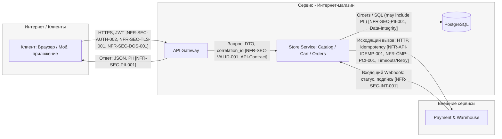

# S04 - DFD

## Mermaid-диаграмма

```mermaid
flowchart LR
  %% --- Trust boundaries (по контурам) ---
  subgraph Internet[Интернет / Клиенты]
    U[Клиент: Браузер / Моб. приложение]
  end

  subgraph Service[Сервис - Интернет-магазин]
    A[API Gateway]
    S[Store Service: Catalog / Cart / Orders]
    DB[(PostgreSQL)]
  end

  subgraph External[Внешние сервисы]
    X[Payment & Warehouse]
  end

  %% --- Основные потоки ---
  U -- "HTTPS, JWT [NFR-SEC-AUTH-002, NFR-SEC-TLS-001, NFR-SEC-DOS-001]" --> A
  A -- "Ответ: JSON, PII [NFR-SEC-PII-001]" --> U

  A -->|"Запрос: DTO, correlation_id [NFR-SEC-VALID-001, API-Contract]"| S
  S -->|"Orders / SQL (may include PII) [NFR-SEC-PII-001, Data-Integrity]"| DB

  S -- "Исходящий вызов: HTTP, idempotency [NFR-API-IDEMP-001, NFR-CMP-PCI-001, Timeouts/Retry]" --> X
  X -- "Входящий Webhook: статус, подпись [NFR-SEC-INT-001]" --> S

  %% --- Оформление границ ---
  classDef boundary fill:#f6f6f6,stroke:#999,stroke-width:1px;
  class Internet,Service,External boundary;
```